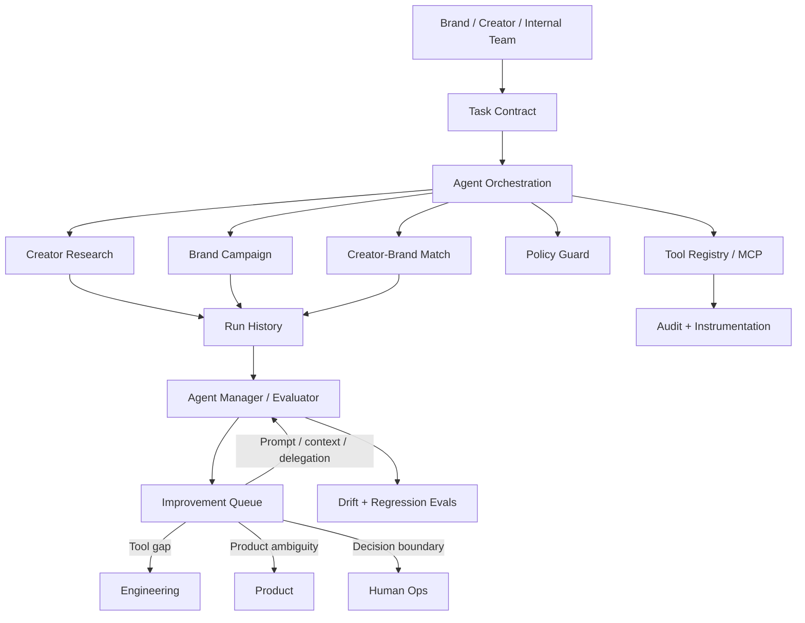

# Enterprise Agent Workbench

> A reference architecture for managing reliable, tool-using AI agents against real customer workflows.

**Portfolio project by Maurice Thomas** — built to demonstrate hands-on agent product management: workflow discovery, agent scope and boundaries, orchestration, tool use, evaluation, quality drift detection, improvement routing, human escalation, and instrumentation.

## Why this exists

Production agents need more than good prompts. Someone has to own **what each agent is for**, understand the people it serves, inspect evidence from real runs, identify recurring gaps, and decide whether an improvement belongs in the prompt/context layer, engineering, product, or human operations.

This workbench treats an agent as a **bounded product inside a larger system** rather than an all-knowing chatbot.

The central question is not:

> Can the model do this once?

It is:

> Can we keep a fleet of agents useful, reliable, on-tone, well-delegated, and inside the boundaries where customers trust them?

## Creator-commerce fleet

The repo now includes a domain-specific example modeled around creator and brand workflows:

| Agent | Job | Key boundary |
| --- | --- | --- |
| `creator_research` | Produce evidence-backed creator research | Never invent audience or performance claims |
| `brand_campaign` | Turn brand goals into measurable campaign briefs | Never invent commercial terms or approve spend |
| `creator_brand_match` | Rank and explain creator-brand fit | No protected-trait inference, unsupported claims, or automatic outreach |
| `agent_manager` | Evaluate runs, detect drift, and route improvements | Never turn unresolved product ambiguity into silent autonomy |

The **Agent Manager** scores run quality across accuracy, usefulness, tone, evidence coverage, and boundary discipline. Failures are classified and routed to the right owner:

- prompt / knowledge / delegation → Agent Manager
- missing tool or capability → Engineering
- undefined customer or product rule → Product
- unresolved consequential decision → Human Operations

This is the core "agent gardening" loop: **run → evaluate → diagnose → route → improve → regression-test → watch for drift**.

See [`docs/CREATOR_COMMERCE_CASE_STUDY.md`](docs/CREATOR_COMMERCE_CASE_STUDY.md).

## Architecture



## What it demonstrates

- **Agent product ownership** through explicit customer, objective, constraints, evidence, and boundaries.
- **Multi-agent orchestration** with specialized creator-commerce agents and intentional delegation.
- **Run evaluation** across quality and boundary dimensions.
- **Failure taxonomy** distinguishing prompt, knowledge, tool, delegation, product, and human-decision problems.
- **Improvement queue routing** to Agent Manager, engineering, product, or human operations.
- **Quality drift detection** across recent run windows.
- **MCP server** exposing enterprise-style tools over stdio.
- **Least-privilege access** and human approval gates for consequential actions.
- **Schema validation**, stateful sessions, audit instrumentation, and deterministic tests.
- **Deterministic local demos** that work without model API keys.
- **Optional Claude integration** via the Anthropic SDK.

## Quick start

```bash
git clone <your-repo-url>
cd enterprise-agent-workbench
npm install
npm run check
npm run dev
```

Run the creator-commerce agent-management demo:

```bash
npx tsx src/commerce/demo.ts
```

It produces structured runs, evaluations, boundary events, and an improvement queue so the management loop can be inspected without external APIs.

## Existing enterprise workflow demo

The original reimbursement workflow remains as a second domain example. A finance user requests a reimbursement; the agent retrieves policy, checks permissions, stops at the approval boundary, and records the attempt rather than falsely claiming execution.

This demonstrates the same principle from another angle: **reliable agents should know when not to act.**

## Project structure

```text
src/
├── agent/
│   ├── orchestrator.ts
│   └── subagents.ts
├── commerce/
│   ├── agents.ts            # Creator-commerce specialist fleet
│   ├── manager.ts           # Evaluator, triage, drift detection
│   ├── demo.ts              # Inspectable gardening-loop demo
│   └── types.ts             # Task, run, eval, improvement contracts
├── mcp/
│   └── server.ts
├── observability/
│   └── audit.ts
├── policy/
│   └── engine.ts
├── skills/
│   └── escalation.ts
├── state/
│   └── store.ts
├── tools/
│   ├── data.ts
│   └── registry.ts
├── demo.ts
└── types.ts

tests/
├── commerce-manager.test.ts
├── policy.test.ts
└── skills.test.ts

docs/
├── CREATOR_COMMERCE_CASE_STUDY.md
├── EVALS.md
└── THREAT_MODEL.md
```

## Evaluation strategy

A production agent should be evaluated as a system, not only on whether an answer sounds good. Relevant metrics include:

- task success rate
- human acceptance / edit rate
- evidence-grounding rate
- boundary violation rate
- escalation precision and recall
- delegation success rate
- tool failure rate
- quality by prompt / agent version
- repeated failure frequency
- drift by workflow or customer segment
- latency and cost per successful task

The deterministic evaluator in `src/commerce/manager.ts` is intentionally inspectable. A production implementation could combine deterministic checks with calibrated LLM-as-judge evaluation and human review.

## Design principles

**Workflow first.** Understand how people actually work before deciding an agent belongs in the process.

**Own the need, not the novelty.** Each agent exists for a specific customer job and should be measured against it.

**Evidence over vibes.** Real runs, failure patterns, evals, and acceptance data drive improvements.

**Route the real problem.** Not every failure is a prompt problem; capability gaps, product ambiguity, and human decisions need different owners.

**Reliability over maximum autonomy.** Expand autonomy only when evidence supports it.

**Humans are part of the architecture.** Escalation is a product feature, not necessarily a failure.

## Tech

TypeScript · Node.js · Anthropic SDK · Model Context Protocol · Zod · Node Test Runner · GitHub Actions

## Author

**Maurice Thomas**  
Austin, Texas  
Applied AI Product · Agentic Systems · LLM Evaluation · Creator Technology

---

This repository uses mock data and fictional workflows for a public portfolio demonstration. It does not connect to or represent any employer's, client's, creator platform's, or brand's private systems, data, or internal architecture.
