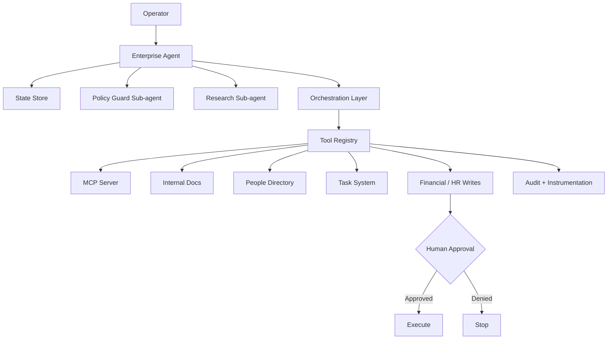

# Enterprise Agent Workbench

> A reference architecture for reliable, tool-using enterprise AI agents.

**Portfolio project by Maurice Thomas** — built to demonstrate applied agent engineering: workflow discovery, MCP tooling, role-aware access, stateful execution, human approval gates, reusable skills, and instrumentation.

## Why this exists

Enterprise AI becomes useful when models can operate inside real workflows — but usefulness without control is a liability.

This project treats an AI agent as a **privileged software system** rather than an all-knowing chatbot. The architecture demonstrates how an agent can retrieve internal context, invoke tools, preserve state, stop at approval boundaries, and leave an inspectable audit trail.

The central question is not:

> Can the model do this once?

It is:

> Can the system do this repeatedly, safely, observably, and with the right human in control?

## Architecture



## What it demonstrates

- **MCP server** exposing enterprise-style tools over stdio.
- **Tool-using agent architecture** with a shared, validated tool registry.
- **Stateful sessions** that preserve workflow context.
- **Stateful sub-agent patterns** for research and policy review.
- **Reusable agent skills** for repeatable business workflows.
- **Least-privilege access** using role-based tool allowlists.
- **Human approval gates** for consequential HR and financial writes.
- **Schema validation** before tool execution.
- **Audit instrumentation** across tool requests, blocks, approvals, and executions.
- **Model-evaluation mindset** with explicit reliability metrics and failure cases.
- **Deterministic local demo mode** that works without API keys.
- **Optional Claude integration** via the Anthropic SDK.

## Example workflow: reimbursement request

A Finance user asks:

```text
Please issue my $650 travel reimbursement and tell me the policy.
```

The agent:

1. Searches internal policy documentation.
2. Identifies the reimbursement action as consequential.
3. Checks the caller's role and tool permissions.
4. Creates an approval boundary instead of silently executing.
5. Records each tool request and policy decision in the audit trail.
6. Reports that execution stopped pending approval.

This is intentional: **reliable agents should know when not to act.**

## Tool surface

| Tool | Purpose | Risk | Approval |
|---|---|---:|---:|
| `search_docs` | Search internal policy/ops knowledge | Low | No |
| `search_people` | Search mock employee directory | Low | No |
| `create_task` | Create a project-management task | Low | No |
| `draft_message` | Draft, but do not send, a message | Low | No |
| `update_employee_record` | Modify employee information | High | Yes |
| `issue_reimbursement` | Execute a financial action | High | Yes |

## Quick start

```bash
git clone <your-repo-url>
cd enterprise-agent-workbench
npm install
npm run check
npm run dev
```

The local demo intentionally runs in deterministic mock mode when no model credentials are present.

### Optional Claude mode

Create `.env` or export:

```bash
export ANTHROPIC_API_KEY="..."
export CLAUDE_MODEL="<model-id>"
npm run dev
```

The model ID is configuration rather than being hard-coded so the project can track model changes without source edits.

## Run the MCP server

```bash
npm run mcp
```

The server uses stdio, making it inspectable with an MCP-compatible host or the MCP Inspector.

```bash
npx @modelcontextprotocol/inspector npm run mcp
```

> MCP protocol traffic owns stdout; server diagnostics are written to stderr.

## Project structure

```text
src/
├── agent/
│   ├── orchestrator.ts      # Main agent lifecycle
│   └── subagents.ts         # Policy + research sub-agent patterns
├── mcp/
│   └── server.ts            # MCP stdio server
├── observability/
│   └── audit.ts             # Audit event instrumentation
├── policy/
│   └── engine.ts            # Role/risk/approval policy engine
├── skills/
│   └── escalation.ts        # Reusable workflow skill
├── state/
│   └── store.ts             # Stateful session memory
├── tools/
│   ├── data.ts              # Mock enterprise data
│   └── registry.ts          # Validated tool layer
├── demo.ts
└── types.ts

tests/
├── policy.test.ts
└── skills.test.ts

docs/
├── EVALS.md
└── THREAT_MODEL.md
```

## Safety model

The agent operates under four rules:

### 1. Least privilege

Tool availability depends on the user's role. An employee should not gain HR-write access because a prompt asked nicely.

### 2. Consequential writes require approval

Financial and employee-record writes are separated from low-risk retrieval and drafting tools.

### 3. Validate before execution

Every tool call crosses a schema boundary before reaching its handler.

### 4. Observe everything important

The audit layer records requests, blocks, approval boundaries, and successful execution so agent behavior can be evaluated as a system.

See [`docs/THREAT_MODEL.md`](docs/THREAT_MODEL.md).

## Evaluation strategy

A production agent should be evaluated across more than answer quality. This repo proposes metrics for:

- task completion
- unauthorized-action rate
- false-success rate
- tool-call correctness
- human-escalation precision
- schema adherence
- state isolation
- latency and cost

See [`docs/EVALS.md`](docs/EVALS.md).

## Production roadmap

This reference implementation intentionally uses mock enterprise systems so it can be public. A production deployment would extend the same boundaries with:

- Google Workspace delegated access
- Slack and Jira connectors
- Salesforce or CRM tools
- Workday/HRIS access
- Okta/OIDC authentication
- AWS-hosted services
- encrypted persistent state
- secrets management
- tamper-resistant logs
- connector-specific scopes
- prompt-injection defenses
- red-team and regression eval suites
- durable approval workflows

## Design principles

**Workflow first.** Understand how people actually work before automating it.

**Agents over chat wrappers.** The model is one component of a larger software system.

**Reliability over maximum autonomy.** Autonomy should increase only when evidence supports it.

**Humans are part of the architecture.** Some actions should require judgment and explicit consent.

**Reusable capabilities beat one-off demos.** Skills and tools should raise the floor for future builders.

## Tech

TypeScript · Node.js · Anthropic SDK · Model Context Protocol · Zod · Node Test Runner · GitHub Actions

## Author

**Maurice Thomas**  
Austin, Texas  
Applied AI · Agentic Systems · Automation · Product Engineering

---

This repository contains mock data only and is designed as a public engineering demonstration. It does not connect to or represent BetterUp systems, data, or internal architecture.
